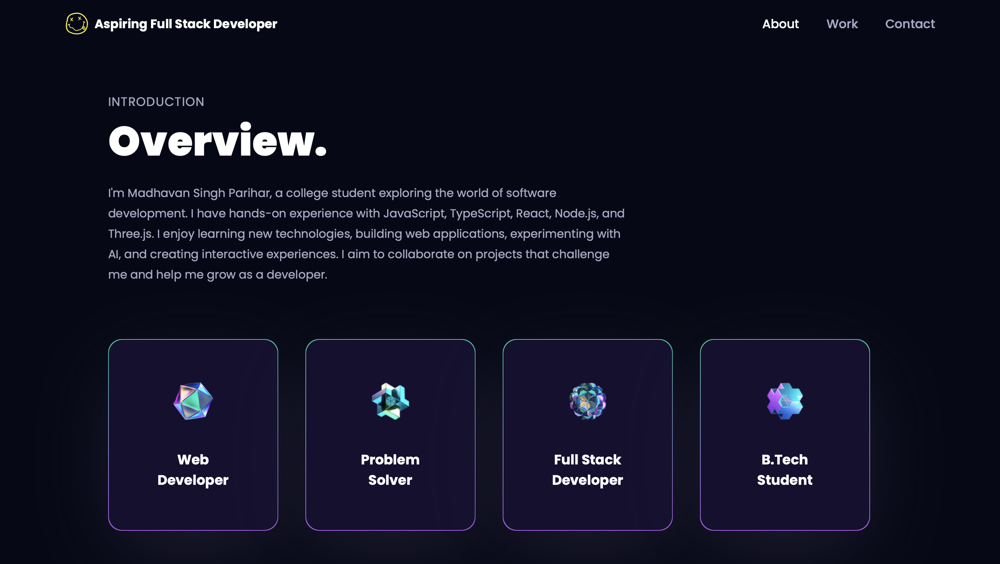

# Madhavan's Portfolio

<!-- GitHub badges -->

## 🌐 Live Demo

Check out the live demo here :  
[Portfolio](https://madhavannn-portfolio.vercel.app)

## 📝 Description

**Madhavan's Portfolio** is a cutting edge, interactive 3D portfolio showcasing projects and skills with stunning Three.js animations, smooth transitions and a fully responsive design that looks perfect on any device.

## ✨ Technologies Used

- [TypeScript](https://www.typescriptlang.org/)
- [React.js](https://reactjs.org/)
- [Three.js](https://threejs.org/)
- [Framer Motion](https://www.framer.com/motion/)
- [Tailwind CSS](https://tailwindcss.com/)
- [Vercel](https://vercel.com/)

## 💎 Acknowledgements

Special thanks to the following technologies and resources that made this project possible:

- [Tailwind CSS](https://tailwindcss.com/)
- [Three.js](https://threejs.org/)
- [Framer Motion](https://www.framer.com/motion/)
- [React Vertical Timeline Component](https://www.npmjs.com/package/react-vertical-timeline-component)
- [React Parallax Tilt](https://www.npmjs.com/package/react-parallax-tilt)
- [EmailJS](https://www.emailjs.com/)
- [Vercel](https://vercel.com/)
- [JavaScript Mastery](https://www.jsmastery.pro/)

## 📋 License

**3D Portfolio** is open source software licensed under the [MIT License](https://github.com/madhavansingh/Portfolio/blob/main/LICENSE).
